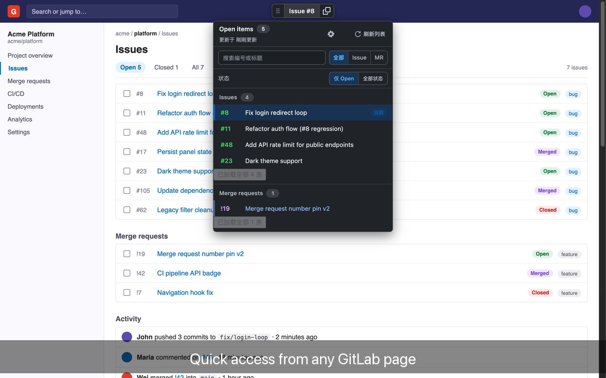
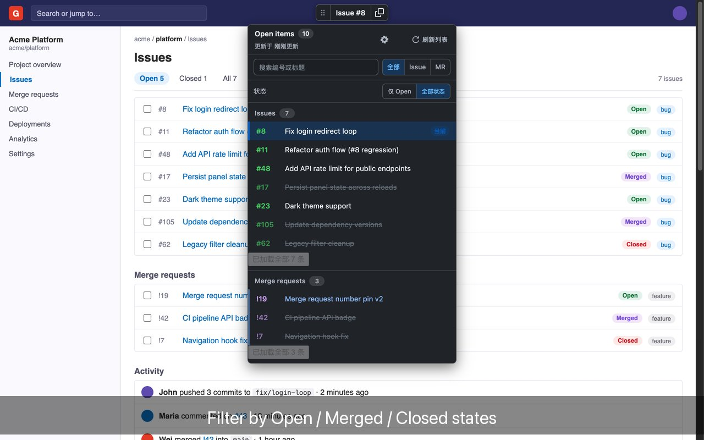
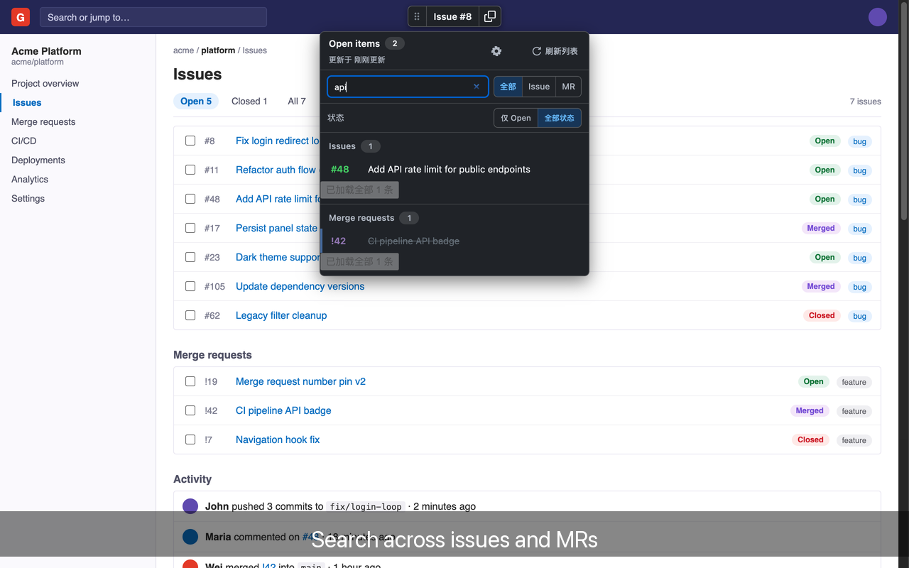
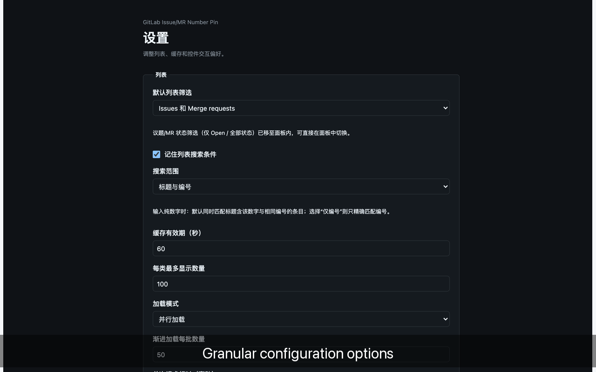
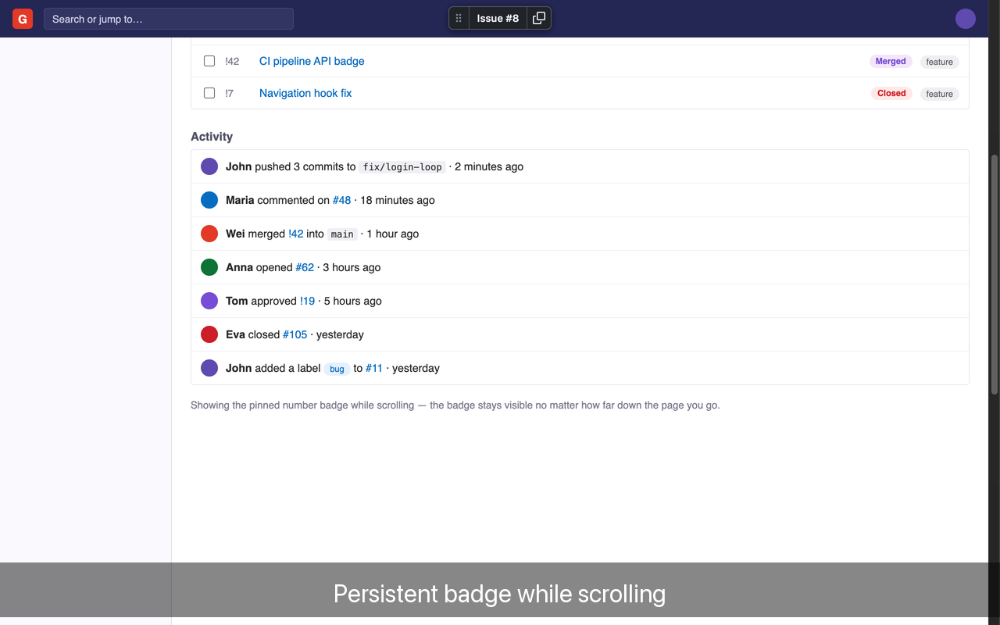

<p align="center">
  
</p>

<h1 align="center">🩷 GitLab Issue/MR Number Pin</h1>

<p align="center">
  <em>Pin the current Issue / MR number at the top of GitLab pages — always visible, one-click copy!</em>
</p>

<div align="center">

[](https://chromewebstore.google.com/detail/gitlab-issuemr-number-pin/dmkkdfokknoilapcghjnncnehagcnfcc)
[](https://chromewebstore.google.com/detail/gitlab-issuemr-number-pin/dmkkdfokknoilapcghjnncnehagcnfcc)
[](LICENSE)
[](https://github.com/jason1105/chrome-show-issue-and-mr-no)
[](https://github.com/jason1105/chrome-show-issue-and-mr-no/releases)

</div>

---

> 🌍 [English](README.md) · [简体中文](README.zh-CN.md) ｜ A zero-build, zero-tracking, zero-upload **Manifest V3** browser extension

---

## 📖 Introduction

**GitLab Issue/MR Number Pin** is a build-free **Manifest V3** browser extension designed for developers who frequently switch between GitLab Issues and Merge Requests.

When you jump back and forth between GitLab Issue or MR detail pages, you're often troubled by "Wait, which number am I looking at right now?". This extension pins the current number badge at the **top of the page**, **stays visible after scrolling**, so you always know which Issue / MR you're on.

| Issue | Merge Request |
|-------|---------------|
| Shows `Issue #123` | Shows `MR !456` |

<p align="center">
  
</p>

---

## ✨ Features

### 🏷️ Floating Number Badge

- **Pins the current number** at the top of Issue/MR detail pages, stays visible when scrolling
- Auto-detects modern and legacy GitLab URLs, supports multi-level namespaces (groups)
- Works with `gitlab.com` and any HTTP/HTTPS self-hosted GitLab domain

### 📋 One-Click Quick Copy

- A persistent **copy button** sits next to the number (like GitHub's repo address control)
- Hover/focus shows `Copy #123` / `Copy !456`; clicking copies the corresponding number
- Shows a green check + "Copied" on success; "Copy failed" on error, auto-resumes after 1.5s
- On non-secure contexts (HTTP) it falls back to the browser's built-in clipboard — no extra permission needed

### 🔎 In-Project Open Issue/MR Navigation

- Hover/focus the number area to expand a list of **all Open Issues and Open MRs** in the current project
- Issues first, MRs after; the current item is highlighted "Current", click any other to jump to its detail page
- **Title-keyword search**; supports `#123` / `!456` exact lookup; plain numbers match number or title by default (can be set to number-only)
- "All / Issue / MR" type filter; search & filtering are all done **locally**, adding no extra API requests
- "Refresh list" bypasses the 60s in-memory cache to fetch the latest immediately

### 🖱️ Draggable Control + Position Memory

- Drag via the six-dot handle on the left to snap the control to the top/left/right edge of the window
- Position persists across pages and browser restarts; auto stays visible on window resize
- Double-click the handle to reset to top-center; the list expands inward based on which edge the control sits on

### 🌐 Full-Repo Mode

- Enable to make it work on **all repository pages** (not just detail pages), so the number hint is available anywhere

### 🧩 Multilingual & Custom Settings

- Built-in localization (`.i18n`), follows your browser language
- Options page can adjust default list filter, search scope, cache TTL, load mode, and more

### ⚡ Zero Build · Zero Dependency · Zero Tracking

- No build step, no remote code, no analytics service, no runtime dependencies
- Minimal permissions: `storage` + `scripting`; all host permissions are optional

---

## 🛠️ Installation

### ✅ Option 1: Chrome Web Store (recommended)

<div align="center">

[](https://chromewebstore.google.com/detail/gitlab-issuemr-number-pin/dmkkdfokknoilapcghjnncnehagcnfcc)

</div>

Direct store link: <https://chromewebstore.google.com/detail/gitlab-issuemr-number-pin/dmkkdfokknoilapcghjnncnehagcnfcc>

### 📦 Option 2: Manual Load (developers)

#### Chrome

1. Open `chrome://extensions`
2. Enable "Developer mode" at the top right
3. Click "Load unpacked"
4. Select this repository's root directory (the one containing `manifest.json`)
5. Keep the extension enabled and refresh your open GitLab pages

#### Arc

1. Open `arc://extensions` (or `chrome://extensions`)
2. Enable "Developer mode"
3. Click "Load unpacked"
4. Select this repository's root directory, then refresh GitLab pages

> 💡 The extension persists after a browser restart. After updating the source, click "Reload" on the extension management page and refresh the GitLab page to apply the new version.

---

## ⚙️ Usage & Configuration

Open "Extension Options" from the extension detail page to open the settings. Settings are stored in `chrome.storage.sync`, synced with your Chrome account, auto-restored after uninstall/reinstall, and **never overridden by remote config**.

| Option | Description | Default |
|--------|-------------|---------|
| Default list filter | All / Issues only / Merge requests only | All |
| Remember search term & filter | Restored on refresh, page reopen, restart | On |
| Search scope | Plain numbers match "title & number" or "number only" | Title & number |
| List cache TTL | 5 ~ 300 seconds | 60 seconds |
| Max display per type | 1 ~ 100 | 100 |
| Load mode | Parallel / Sequential | Parallel |
| Show last refresh time | Panel shows refresh time | On |
| Allow touch drag | Touch devices can drag the control | On |
| Keyboard move step | 1 ~ 50 pixels | 8 pixels |

> ⚙️ The options page provides "Save settings" and "Restore defaults"; when an input is out of range or illegal, the config layer auto-restores a legal value.

---

## 📸 Screenshots

<p align="center">
  
  
</p>

<p align="center">
  
  
</p>

<p align="center">
  
</p>

---

## 🔐 Permissions & Privacy

To support unknown self-hosted GitLab domains right after installation, the content script matches all HTTP/HTTPS sites, so Chromium shows a "Read and change all your data on all websites" notice.

- Only parses the current page URL to create/update/remove the pinned badge
- On the first open of the navigation list, calls the current site **same-origin** GitLab REST API v4, reading only the current project's Open Issues/MRs
- Reuses your existing GitLab login session — **never reads or stores tokens, Cookies**, or credentials
- Caches IID, title, and detail URL in memory only (default 60s, configurable 5~300s)
- Uses the `storage` permission to save control position `{ edge, ratio }` and your preferences, search terms, type filters
- **Never reads** Issue/MR body content, comments, or account profiles; **never uploads any data**
- Doesn't request `tabs`, `cookies`, `identity`, or similar permissions; **no remote code, analytics, or runtime dependencies**

> 🛡️ Zero data collection · Zero remote code · Versioned config · Reads at most 100 items per type at a time

**Implementation source**: [URL parser](src/parser.js) · [config layer](src/config.js) · [content script](src/content.js) · [options page](src/options.html) · [Manifest](manifest.json)

---

## 🧑‍💻 Development & Testing

Run unit tests and static checks:

```bash
npm test
```

Run real Chromium browser tests:

```bash
npm run test:browser
```

Browser tests require Chrome/Chromium and a ChromeDriver of the same major version; you can specify the executables via environment variables:

```bash
CHROME_PATH="/path/to/chrome" \
CHROMEDRIVER_PATH="/path/to/chromedriver" \
npm run test:browser
```

See [Testing](docs/testing.md) for the full test environment, coverage matrix, automation results, and manual acceptance boundaries.

**Design/implementation docs**:

- Badge: [design](docs/superpowers/specs/2026-07-29-gitlab-reference-badge-design.md) · [implementation](docs/superpowers/plans/2026-07-30-gitlab-reference-badge-implementation.md)
- Quick copy: [design](docs/superpowers/specs/2026-07-31-gitlab-reference-quick-copy-design.md) · [implementation](docs/superpowers/plans/2026-07-31-gitlab-reference-quick-copy-implementation.md)
- Navigation: [design](docs/superpowers/specs/2026-07-31-gitlab-open-items-navigation-design.md) · [implementation](docs/superpowers/plans/2026-07-31-gitlab-open-items-navigation-implementation.md)

---

## 🤝 Contributing

Issues and Pull Requests are welcome! Please follow:

1. Fork this repository and create a new feature branch
2. Run `npm test` before submitting to make sure it passes
3. Describe your changes and self-test evidence clearly in the PR
4. Keep the minimal-permission and zero-remote-code principles

---

## 📄 License

This project is open-sourced under the **MIT License**. See the [LICENSE](LICENSE) file.

`Copyright (c) 2026 jason1105`

---

## 🙏 Acknowledgements

Thanks to all developers who use, test, and give feedback. If this extension helps you, feel free to give it a ⭐!
